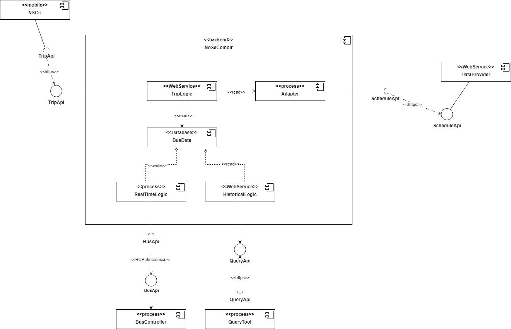

### Título 

ADR 001: Implementacion del patrón `adapter` para la comunicación entre `TripLogic` y los `DataProvider`
### Estado: 

Propuesto 

### Participantes: 

228151 - Bruno Quadrelli

314064 - Ignacio Santalla

276280 - Santiago Alfonso

215542 - Juan Cano

270956 - Pablo Duran

### Contexto: 

Estamos creando un sistema que tiene como requerimiento no funcional, que cualquier cambio de en las API de los distintos `DataProvider` no debe tener impacto en el servicio `TripLogic`

### Decisión: 
Se decidió implementar un patrón adapter para crear una capa intermedia entre los `DataProvider` y `TripLogic`. Este adaptador transformará las respuestas de las APIs de los `DataProvider` en un formato que `TripLogic` pueda procesar sin cambios significativos en su lógica interna.

### Consecuencias: 
- Cualquier cambio en las API de `DataProvider` sera manejado por el adaptador evitando cambios en `TripLogic`.
- Se agrega una capa adicional lo que agrega complejidad al sistema, ya que cada API va a necesitar su propio adaptador.

