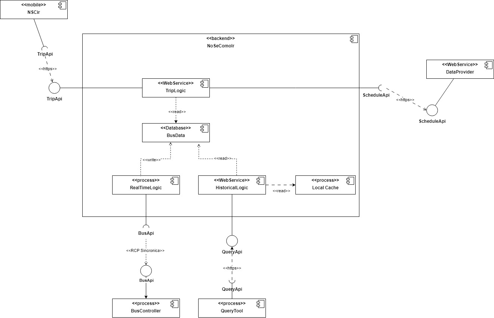

### Titulo
ADR 002: Implementación de Tactica de multiples copias de datos en el servicio HistoricalLogic

### Participantes: 

228151 - Bruno Quadrelli

314064 - Ignacio Santalla

276280 - Santiago Alfonso

215542 - Juan Cano

270956 - Pablo Duran

### Estado
Propuesto

### Contexto
El servicio web HistoricalLogic permite a la autoridad de Control de Tránsito realizar consultas complejas sobre los recorridos históricos de los ómnibus. Estas consultas suelen ser masivas y frecuentes, lo que genera una carga considerable en el sistema y afecta la disponibilidad del servicio. El rendimiento de estas consultas debe mejorarse para cumplir con los tiempos de respuesta esperados.

### Decisión:
Se propone implementar una táctica de caché para almacenar los resultados de las consultas históricas más frecuentes. El uso de un caché permitirá que estas consultas sean atendidas sin necesidad de recalcular la información, mejorando la disponibilidad del servicio y reduciendo la carga en la base de datos.

### Consecuencias
Positivas:
- Mejora en tiempos de respuesta: Las consultas frecuentes se atenderán directamente desde el caché, reduciendo el tiempo de procesamiento.
- Reducción de la carga del sistema: Se disminuirá la carga sobre el servicio de consultas complejas, optimizando el uso de recursos.

Negativas: 
- Mantenimiento del caché: Se requiere gestionar la caducidad de los datos almacenados en caché y la actualización de los mismos cuando cambian los datos históricos.

