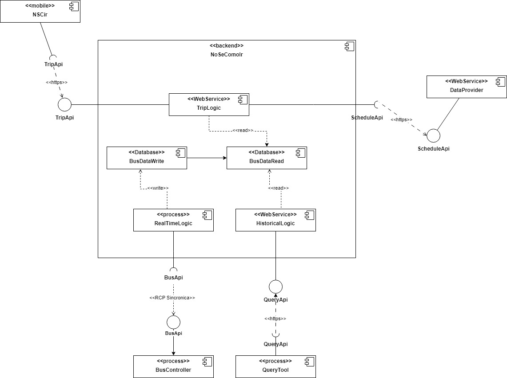

### Título 
ADR 003: Implementacion del patron `CQRS` para separar las operaciones de lectura y escritura

### Participantes: 

228151 - Bruno Quadrelli

314064 - Ignacio Santalla

276280 - Santiago Alfonso

215542 - Juan Cano

270956 - Pablo Duran

### Estado
Propuesto

### Contexto
En el sistema actual, la autoridad de transito realiza consultas masivas sobre los datos, lo que puede interferir con la actualizacion del recorrido de los ómnibus, afectando el rendimiento general del sistema. Para evitar estos problemas se proporne implementar el patron `CQRS` para separar las operaciones de lectura de las de escritura. Este patrón podría ser una buena solución para los requerimientos no funcionales "b" y "c", los cuales hacen enfasis en la lectura y escritura de la base de datos.

### Decisión:
Se propone implementar el patrón CQRS (Command Query Responsibility Segregation) para separar las operaciones de lectura (consultas) de las operaciones de escritura (comandos). Esto permitirá que ambas se procesen de manera independiente y se ejecuten sin interferencias entre sí.

### Consecuencias
Positivas:
- Mejora en la disponibilidad: Al separar las operaciones de lectura y escritura, las consultas masivas no afectarán las operaciones de actualización de datos.
- Escalabilidad: Se puede escalar de manera independiente los componentes de lectura y escritura según las necesidades del sistema.
- Desempeño mejorado: Las consultas serán más eficientes, dado que no competirán con las operaciones de escritura por recursos.

Negativas:
- Complejidad en la arquitectura: El patrón CQRS introduce una mayor complejidad en la estructura del sistema, dado que se deben gestionar dos modelos de datos separados (uno para lectura y otro para escritura).

