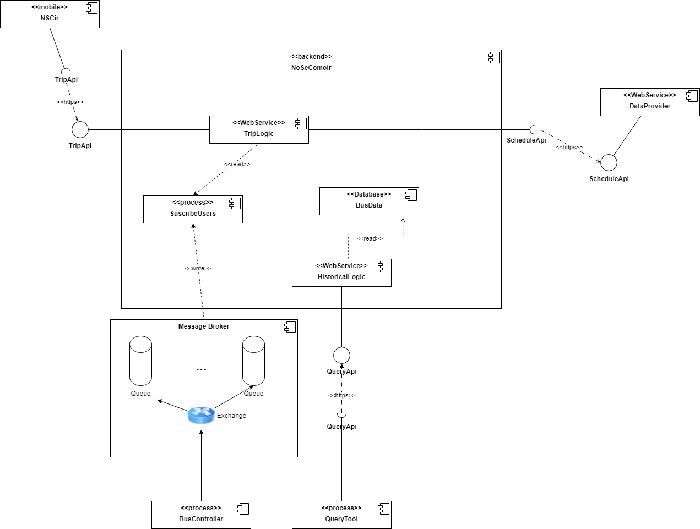

### Título 
ADR 004: Implementación del Patrón Publisher/Subscriber para Ubicación en Tiempo Real de Ómnibus

### Participantes: 

228151 - Bruno Quadrelli

314064 - Ignacio Santalla

276280 - Santiago Alfonso

215542 - Juan Cano

270956 - Pablo Duran

### Estado
Propuesto

### Contexto
El servicio TripLogic permite a los usuarios obtener la ubicación en tiempo real de los ómnibus a través de consultas a la base de datos (Bus Data). Sin embargo, realizar consultas constantes para obtener la ubicación de los ómnibus puede generar una sobrecarga considerable en la base de datos, afectando negativamente el rendimiento del sistema. Se requiere una solución que mejore la performance del sistema al tiempo que proporciona datos actualizados a los usuarios sin depender de consultas constantes.

### Decisión:
Se propone implementar el patrón Publisher/Subscriber, donde cada bus tiene su propio canal de comunicación dentro de una cola de eventos. Los usuarios interesados en la ubicación de un bus específico pueden suscribirse al canal correspondiente, y el bus publicará su ubicación a la cola cada 30 segundos. Los eventos de ubicación serán distribuidos automáticamente a los usuarios suscriptores sin necesidad de realizar consultas directas a la base de datos. Por último, la información se enviará a la base de datos para su persistencia.

### Consecuencias
Positivas:
- Reducción de consultas a la base de datos: Al evitar consultas frecuentes para obtener la ubicación de los ómnibus, se reduce la carga en la base de datos, mejorando el rendimiento general del sistema.
- Datos en tiempo real más eficientes: Los usuarios recibirán actualizaciones directamente desde la cola de eventos, lo que garantiza que la información esté actualizada sin la necesidad de hacer consultas repetitivas.

Negativas:
- Sobrecarga de suscriptores: En caso de que haya muchos usuarios suscritos a múltiples canales, se podría generar una sobrecarga en la infraestructura de mensajería si no está bien optimizada.

